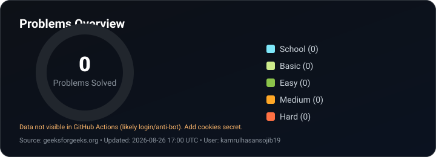

<h1 align="center">Hi, I'm Kamrul Hasan Sojib 👋</h1>
 

  

  
  

---

### 👨‍💻 About Me

- Final-year CSE Student researching **Multi-Class Skin Disease Classification** using Deep Learning for Capstone Project
- Experienced in Full-Stack Web Development (MERN Stack) from model training to full app implementation
- Active Competitive Programmer with a strong foundation in Data Structures & Algorithmic Problem Solving
- Interested in **AI/ML**, computer vision, and building tech solutions for real-world problems
- Exploring disaster-response & emergency-intelligence systems, and open to Software Engineering roles
- Reach me via GitHub

---

## 🌐 Connect With Me

  
  
  

### 🚀 Featured Projects

| Project                                       | Description                                                                                                                                             |
| --------------------------------------------- | ------------------------------------------------------------------------------------------------------------------------------------------------------- |
| **Skin Disease Classification**               | Multi-class skin lesion classification using ResNet-50, EfficientNet-B4, and VGG-16 on HAM10000 & ISIC datasets, with Grad-CAM explainability           |
| **AI-Powered Disaster Intelligence Platform** | Concept platform for flood/cyclone/fire response in Bangladesh — GIS live mapping, rescue optimization, satellite CV analysis, and a citizen-facing app |

---

### 🧰 Tech Stack

  

---

### 📊 GitHub Stats

<table align="center">
<tr>
    <td align="center" width="405">
        
    </td>
    <!-- <td align="center">
      
    </td> -->
    <td align="center">
      
    </td>
  </tr>
</table>

 

  

⭐️ Thanks for visiting my profile!

